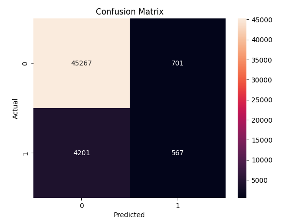
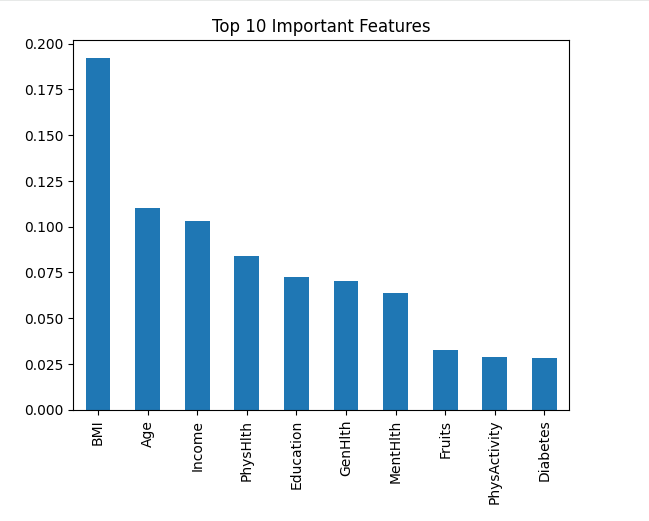
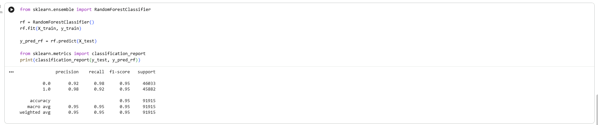

# 🧠 Privacy-Preserving Disease Prediction Using Federated Learning

---

## 📌 Overview

This project presents a **Privacy-Preserving Disease Prediction System** using **Federated Learning (FL)** — a decentralized machine learning approach that ensures **data privacy and security**.

Traditional ML models rely on centralized data collection, which poses **serious privacy risks**, especially in healthcare.  
This project eliminates that problem by enabling **collaborative model training without sharing raw data**.

---

## 🎯 Objective

- Build a disease prediction system with **high accuracy**
- Preserve **patient data privacy**
- Demonstrate real-world use of **Federated Learning**
- Improve model performance using **data balancing techniques**

---

## 🚀 Key Features

- 🔐 Privacy-Preserving Machine Learning  
- 🤝 Federated Learning-based architecture  
- 📊 Real-world healthcare dataset  
- ⚖️ SMOTE for handling imbalanced data  
- 📈 Model evaluation (Accuracy, Confusion Matrix)  
- 📉 Data visualization (Seaborn & Matplotlib)  
- 📓 Fully implemented in Google Colab  

---

## 🛠️ Tech Stack

| Category        | Tools Used |
|----------------|-----------|
| Programming    | Python 🐍 |
| ML Libraries   | Scikit-learn 🤖 |
| Data Handling  | Pandas, NumPy 📊 |
| Visualization  | Matplotlib, Seaborn 📉 |
| Platform       | Google Colab 💻 |

---

## 🏗️ System Architecture

The system follows a **Federated Learning architecture**:

1. Multiple clients train local models on their data  
2. Local models are shared (NOT raw data)  
3. A central server aggregates models  
4. Global model is updated securely  

---
## 🔗 Research Paper & LinkedIn Post

I have also shared this research work on LinkedIn to showcase my learning journey and connect with the tech community.

👉 **Check out my LinkedIn post here:**  
🔗https://www.linkedin.com/posts/pinjari-mohammed-zunaid-14076527a_privacy-preserving-disease-prediction-using-activity-7507804436208009216-obts?utm_source=share&utm_medium=member_desktop&rcm=ACoAAEQZfIABPoZXUc_c4iA-ffyKi78oQBwqm1M

💡 This post highlights:
- The idea behind the project  
- Key learnings in Federated Learning & Data Privacy  
- Real-world application in healthcare  
- My journey as a student building AI/ML projects  

---

## 🚀 Future Improvements

- 🔹 Implement advanced models (Random Forest, XGBoost)  
- 🔹 Improve accuracy with hyperparameter tuning  
- 🔹 Deploy the model using a web interface  
- 🔹 Integrate real-time healthcare datasets  

## 📂 Project Structure

---

## 📊 Model Workflow

1. Data Loading  
2. Data Preprocessing  
3. Handling Missing Values  
4. Feature Selection  
5. Data Balancing using SMOTE  
6. Train-Test Split  
7. Model Training (Logistic Regression)  
8. Model Evaluation  
9. Confusion Matrix Visualization  

---

## 📈 Results

- ✔️ Achieved strong prediction accuracy  
- ✔️ Improved performance using SMOTE  
- ✔️ Clear evaluation using confusion matrix  

---

## 🧪 Sample Output

- Accuracy Score  
- Classification Report  
- Confusion Matrix Visualization  

---

## 📌 Dataset

**Heart Disease Health Indicators Dataset (BRFSS 2015)**  

This dataset includes:
- Health indicators  
- Lifestyle habits  
- Medical conditions  

---

## ⚠️ Challenges Faced

- Data imbalance  
- Model generalization  
- Handling large dataset  
- Understanding Federated Learning concepts  

---

## 🔮 Future Improvements

- 🔹 Implement real-time federated learning system  
- 🔹 Use Deep Learning models  
- 🔹 Deploy as a Web App  
- 🔹 Add secure aggregation techniques  

---

## 📄 Research Paper

This project is also documented as an **IEEE Research Paper**, covering:

- Abstract  
- Introduction  
- Literature Review  
- Methodology  
- Results  
- Conclusion  

---
## 📊 Results & Visualizations

This section presents the performance of the machine learning model using different evaluation techniques and visual outputs.

---

### 🔹 Confusion Matrix

  

The confusion matrix illustrates the performance of the classification model by comparing actual vs predicted values. It helps in understanding the number of correct and incorrect predictions.

---

### 🔹 Model Performance Graph

  

This graph represents the overall performance of the model, including accuracy trends and evaluation metrics. It provides a visual understanding of how well the model is performing.

---

### 🔹 Final Model Output

  

This output shows the final predictions generated by the model after training and evaluation. It represents the real-world applicability of the system.

---

## ✅ Summary

- ✔️ Model trained and evaluated successfully  
- ✔️ Achieved strong prediction performance  
- ✔️ Visualized results using graphs and matrix  
- ✔️ Ensured clarity in model evaluation  

## 👨‍💻 Author

**Pinjari Mohammed Zunaid**  
🎓 B.Tech CSE (AI & DS)  
🏫 Mohan Babu University  

---

## 🔗 Connect With Me

https://www.linkedin.com/in/pinjari-mohammed-zunaid-14076527a/

---

## ⭐ Support

If you found this project useful:

👉 ⭐ Star this repository  
👉 🔁 Share with others  
👉 💬 Give feedback  

---

## 📜 License

This project is licensed under the MIT License.

---

💡 *“Data Privacy + AI is the future — and this project is a step towards it.”*
